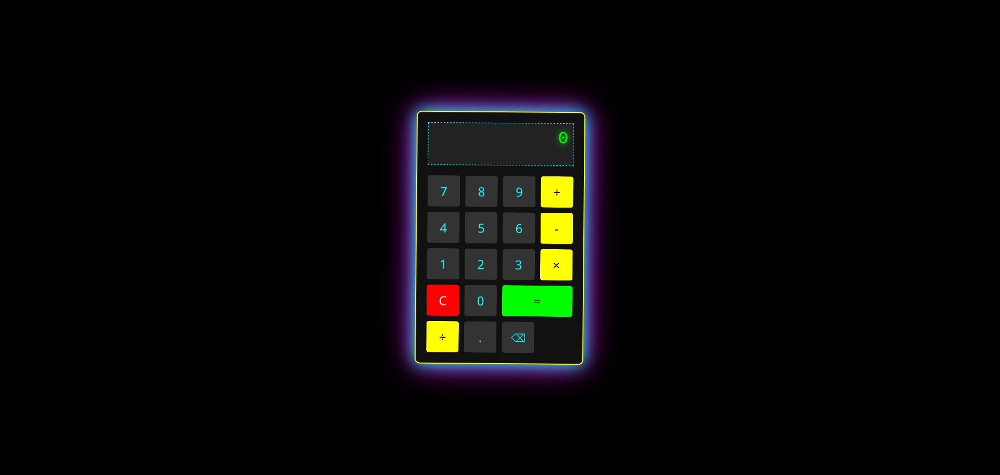

# 🔮 GLITCH CALCULATOR

A cyberpunk-style calculator with trippy visual effects



## Features
- Glowing neon interface
- Keyboard support
- Error handling
- Animated hover effects

## How to Run
1. Clone the repo:
   ```bash
   git clone https://github.com/yourusername/glitch-calculator.git
